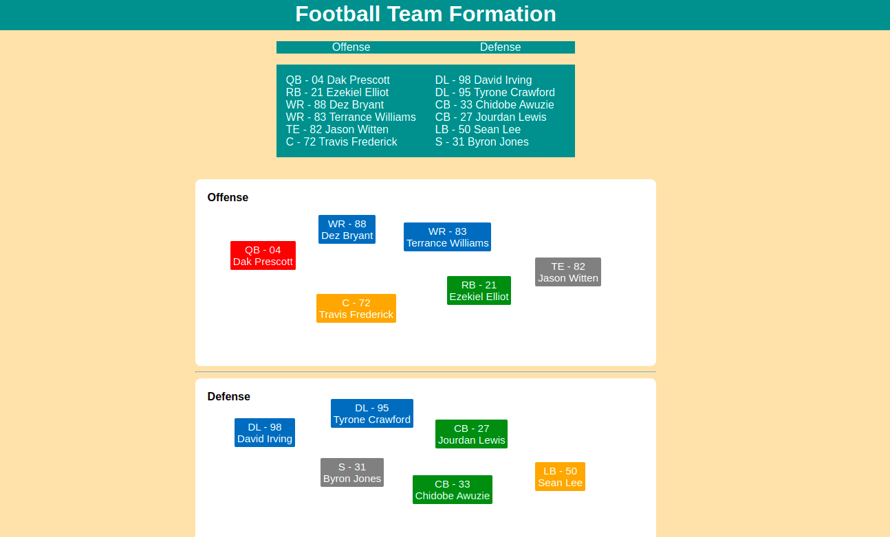

## Footjs

Footjs is a webapp that allows you to organize the alignment of a football team. Use the interact.js library.

### License

This project is GPL v2 software. See the LICENSE.txt file in this directory for complete text.

### Current Mainteiners
 + José Espinosa github.com/pepenauta

Read more about this library at interactjs.io [1].

[1] http://interactjs.io/
